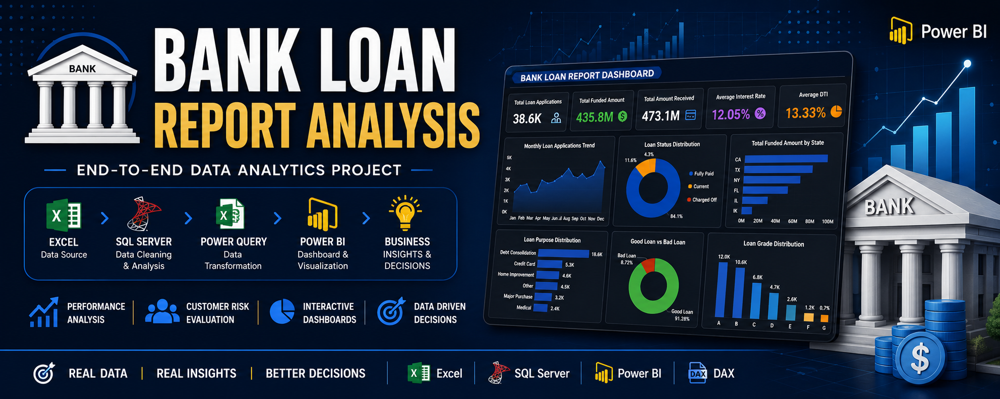

<div align="center">

# 🏦 Bank Loan Report Analysis
 
### End-to-End Business Intelligence Project — SQL Server × Power BI × Excel
 
[](.)
[](.)
[](.)
[](.)
[](LICENSE)
[](.)
 
**Turning 38,576 raw loan records into a decision-ready lending intelligence report.**
 
[📊 Dashboards](#-dashboards) • [🧠 Insights](#-key-insights) • [🗃 SQL](#-sql-analysis) • [🎥 Demo](#-video-walkthrough) • [📁 Structure](#-repository-structure)
 
</div>
---
 
## 📌 Overview
 
**Bank Loan Report Analysis** is a full-cycle data analytics project that simulates a real credit-risk & lending performance report for a bank's loan portfolio. Raw loan-application data is cleaned and analyzed in **SQL Server**, then modeled and visualized in **Power BI** to produce a three-page executive report covering portfolio health, loan quality, and applicant-level detail.
 
The goal: give lending managers and risk teams a single source of truth to answer questions like *"Are we issuing more good loans than bad ones?", "Which states and purposes drive the most risk?", "How is our portfolio trending month over month?"* — without digging through spreadsheets.
 
**Dataset at a glance**
 
| Metric | Value |
|---|---|
| Records analyzed | **38,576** loan applications |
| Fields per record | **24** attributes (borrower, loan, risk & repayment data) |
| Time period | Jan – Dec 2021 |
| Data source | `Bank_loan_data.xlsx` |
| Grain | One row = one loan application |
 
---
 
## 🎯 Business Problem
 
A bank issues thousands of loans every month across every U.S. state, but has no unified way to monitor portfolio health. Leadership can't easily answer:
 
- Is the loan book growing month over month, and is it healthy?
- What share of the portfolio is **"Good"** (Fully Paid / Current) vs **"Bad"** (Charged Off)?
- Which states, purposes, terms, and borrower profiles carry the most risk?
- How does the funded amount compare to the amount actually collected?
**Objective:** Build a SQL-driven analysis and an interactive Power BI report that tracks loan performance, segments risk, and supports faster, data-backed lending decisions.
 
---
 
## 🧭 Project Workflow
 
<div align="center">

</div>
```
Raw Excel Dataset (38,576 records)
        │
        ▼
SQL Server – Data Cleaning & Validation
        │
        ▼
SQL Server – KPI & Segment Analysis (CTEs, Window Functions, Aggregates)
        │
        ▼
Power Query – Transformation & Load
        │
        ▼
Power BI Data Model + DAX Measures
        │
        ▼
3-Page Interactive Dashboard (Summary → Overview → Details)
        │
        ▼
Business Insights & Lending Recommendations
```
 
---
 
## 🛠 Tools & Tech Stack
 
| Tool | Role in this Project |
|---|---|
| **Microsoft Excel** | Raw data source (`Bank_loan_data.xlsx`, 24 columns) |
| **SQL Server (T-SQL)** | Data cleaning, KPI queries, segmentation, MTD/PMTD logic |
| **Power Query** | ETL — shaping and loading data into the model |
| **Power BI** | Data modeling, DAX measures, interactive report design |
| **DAX** | Good/Bad loan %, MTD & MoM measures, dynamic KPI cards |
 
---
 
## 📊 Dashboards
 
The report is built as **three connected pages**, moving from headline KPIs → trend analysis → loan-level drill-down.
 
### 1️⃣ Summary — Loan Portfolio Health
 

The primary KPI page. At a glance, it surfaces total applications, funded amount, amount collected, average interest rate, and average DTI — each with **Month-to-Date (MTD)** and **Month-over-Month (MoM)** change indicators — plus a clean **Good Loan vs. Bad Loan** breakdown.
 
### 2️⃣ Overview — Trends & Segmentation
 

Slices the portfolio across time and borrower dimensions: monthly application/funding trends, a state-by-state funding map, and breakdowns by **loan term, employment length, home ownership, and loan purpose**.
 
### 3️⃣ Details — Loan-Level Grid
 

A fully filterable, sortable grid of individual loan records — borrower state, grade, term, employment length, DTI, interest rate, loan amount, and status — for drill-down and audit-style investigation.
 
> 🎥 See these dashboards in motion in the [Video Walkthrough](#-video-walkthrough) below.
 
---
 
## 📈 Key Performance Indicators
 
Built entirely with SQL aggregates and refined into Power BI DAX measures:
 
| KPI | Definition |
|---|---|
| **Total Loan Applications** | Count of all loan records (with MTD & MoM variants) |
| **Total Funded Amount** | Sum of `loan_amount` disbursed |
| **Total Amount Received** | Sum of `total_payment` collected from borrowers |
| **Average Interest Rate** | Mean `int_rate` across the portfolio |
| **Average DTI** | Mean Debt-to-Income ratio of borrowers |
| **Good Loan %** | Share of loans `Fully Paid` or `Current` |
| **Bad Loan %** | Share of loans `Charged Off` |
| **Loan Status Breakdown** | Applications, funded amount & received amount by status |
 
---
 
## 🗃 SQL Analysis
 
All business logic lives in [`SQL Queries/Bank_Loan_All_SQL_Queries.sql`](<SQL Queries/Bank_Loan_All_SQL_Queries.sql>), organized to mirror the dashboard pages: **Summary KPIs → Good/Bad Loan splits → Loan Status → Overview segmentation** (by month, state, term, employment length, purpose, and home ownership).
 
**Sample — Good vs. Bad Loan segmentation:**
 
```sql
-- Good Loan Percentage
SELECT
    (COUNT(CASE WHEN loan_status = 'Fully Paid' OR loan_status = 'Current' THEN id END) * 100.0) /
    COUNT(id) AS Good_Loan_Percentage
FROM bank_loan_data;
 
-- Bad Loan Percentage
SELECT
    (COUNT(CASE WHEN loan_status = 'Charged Off' THEN id END) * 100.0) /
    COUNT(id) AS Bad_Loan_Percentage
FROM bank_loan_data;
```
 
**Sample — Monthly trend for the Overview page:**
 
```sql
SELECT
    MONTH(issue_date) AS Month_Number,
    DATENAME(MONTH, issue_date) AS Month_name,
    COUNT(id) AS Total_Loan_Applications,
    SUM(loan_amount) AS Total_Funded_Amount,
    SUM(total_payment) AS Total_Amount_Received
FROM bank_loan_data
GROUP BY MONTH(issue_date), DATENAME(MONTH, issue_date)
ORDER BY MONTH(issue_date);
```
 
**SQL concepts applied:** `SELECT` / `WHERE` / `GROUP BY` / `ORDER BY`, `CASE` expressions, aggregate functions, MTD/PMTD date filtering, and multi-dimension segmentation (state, term, purpose, employment length, home ownership, grade).
 
A fully documented version of every query is also available in [`SQL Queries/Bank_Loan_SQL_Query_Document.docx`](<SQL Queries/Bank_Loan_SQL_Query_Document.docx>).
 
---
 
## 💡 Key Insights
 
- The portfolio is **healthy overall** — loans marked `Fully Paid` or `Current` ("Good Loans") substantially outnumber `Charged Off` ("Bad Loans"), both in application count and funded amount.
- **Debt Consolidation** is the single largest driver of loan volume by purpose, well ahead of categories like credit card refinancing or home improvement.
- Funding activity is **not evenly distributed geographically** — a handful of states account for a disproportionate share of total funded amount.
- **Shorter-term loans (36 months)** show different risk and repayment characteristics than **60-month loans**, visible in their respective interest rate and DTI profiles.
- Borrowers with **longer employment history** and **verified income** trend toward better repayment outcomes than those with shorter tenure or unverified status.
- **Average interest rate and DTI move together** — riskier loan grades correlate with higher borrowing costs, consistent with standard credit-risk pricing.
---
 
## ✅ Business Recommendations
 
- Tighten underwriting criteria for segments showing elevated `Charged Off` rates (e.g. specific purposes, grades, or states).
- Prioritize retention and cross-sell for the "Good Loan" segment — these borrowers are the portfolio's most profitable and lowest-risk base.
- Monitor high-DTI applicants more closely before approval; DTI is a leading indicator of repayment risk in this dataset.
- Introduce regional lending strategy reviews for states with high funded amounts but weaker collection performance.
- Automate this report with a scheduled refresh so risk and lending teams always work from current data, not static exports.
---
 
## 🎥 Video Walkthrough
 
A full narrated walkthrough — business problem, SQL cleaning & analysis, Power BI build, and final insights — is available here:
 
▶️ **[Watch on YouTube](https://youtu.be/SnEZMBiGmPE)**
 
Also embedded in [`Demo/README.md`](Demo/README.md), alongside the raw screen-recording in [`Power BI/Project Videodemo_walkthrough.mp4.mp4`](<Power BI/Project Videodemo_walkthrough.mp4.mp4>).
 
---
 
## 📁 Repository Structure
 
```
Bank-Loan-Report-Analysis
│
├── Assets./                          # Banner & branding assets
│   └── Banner.png
│
├── Dataset/
│   └── Bank_loan_data.xlsx           # Source data — 38,576 rows × 24 columns
│
├── SQL Queries/
│   ├── Bank_Loan_All_SQL_Queries.sql # All T-SQL used across the report
│   └── Bank_Loan_SQL_Query_Document.docx
│
├── Power BI/
│   ├── BANK LOAN REPORT - SUMMARY.png
│   ├── BANK LOAN REPORT - OVERVIEW.png
│   ├── BANK LOAN REPORT - DETAILS.png
│   └── Project Videodemo_walkthrough.mp4.mp4
│
├── Dashboard Images/                 # Report page exports (used in this README)
│   ├── BANK LOAN REPORT - SUMMARY.png
│   ├── BANK LOAN REPORT - OVERVIEW.png
│   └── BANK LOAN REPORT - DETAILS.png
│
├── Documentation/
│   ├── Bank_Loan_Report_Analysis_Full.pptx
│   ├── Bank_Loan_Report_Documentation (1).docx
│   └── work flow.png
│
├── Demo/
│   └── README.md                     # Video walkthrough details
│
├── LICENSE                           # MIT License
└── README.md
```
 
---
 
## 📥 How to Explore This Project
 
1. **Clone the repo**
```bash
   git clone https://github.com/sidducv0528/Bank-Loan-Report-Analysis.git
```
2. **Review the data** — open `Dataset/Bank_loan_data.xlsx` to see the raw structure (24 fields including `loan_status`, `int_rate`, `dti`, `purpose`, `address_state`, `emp_length`, etc.).
3. **Run the SQL** — load `SQL Queries/Bank_Loan_All_SQL_Queries.sql` into SQL Server (or any T-SQL-compatible engine) against the dataset to reproduce every KPI.
4. **Review the dashboards** — open the exported pages in `Dashboard Images/` or `Power BI/`, or watch the [video walkthrough](#-video-walkthrough) for the full interactive experience.
5. **Read the write-up** — `Documentation/Bank_Loan_Report_Documentation (1).docx` and the accompanying `.pptx` walk through methodology and findings end to end.
---
 
## 🚀 Future Enhancements
 
- [ ] Machine learning model for loan-default prediction
- [ ] Customer credit-scoring layer
- [ ] Power BI Service deployment with scheduled refresh
- [ ] Python/EDA notebook as a complementary analysis track
- [ ] Fraud-pattern detection on top of existing risk segments
---
 
## 📚 Skills Demonstrated
 
`SQL Server` · `T-SQL` · `Power BI` · `Power Query (ETL)` · `DAX` · `Data Cleaning` · `KPI Design` · `Data Modeling` · `Dashboard Design` · `Business & Risk Analysis`
 
---
 
## 👨‍💻 Author
 
**Siddu Varikuppala**
 
[](https://in.linkedin.com/in/siddu-data)
[](https://github.com/sidducv0528)
 
---
 
<div align="center">
### ⭐ If this project helped you, consider giving it a star — it genuinely helps!
 
*Licensed under the [MIT License](LICENSE).*
 
</div>
